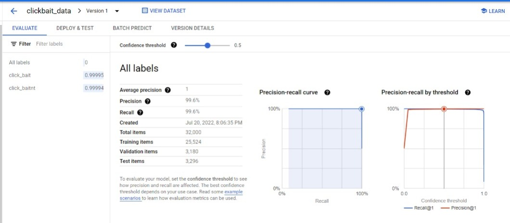
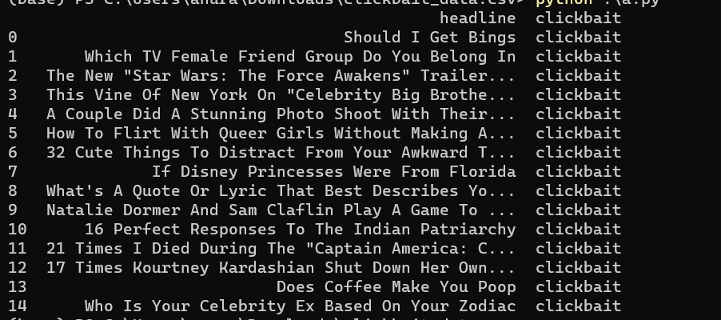
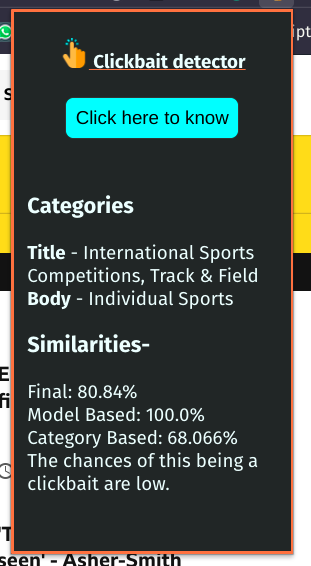
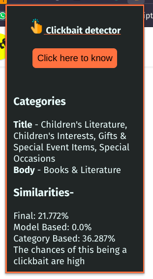

# AI/ML tools in GCP

### Team Members:
- Anurag Khanra - PES1UG19CS072
- Arvind Krishna - PES1UG19CS090

### Setup
- ##### Requirements
	- GCP account with resources available
	- The auth token for the GCP user named as `key.json` in `API/`
	- Python3, pip & virtualenv

- ##### Usage
	- Clone the repository using `git clone git@github.com:ArvindAROO/GCP-clickbait-detection.git`
	- Create a virtualenv using `source venv/bin/activate # ./venv/Scripts/activate`
	- Activate the same with `virtualenv venv # python -m venv venv`
	- Install dependencies with `pip3 install -r requirements.txt`
	- Start the backend with `cd API && python app.py`
	- Load the `plugin/` folder into any Chromium-based browsers extension using _load unpacked_ option

### Working
- As soon as the button is clicked, the extension with a API call to the backend, with the link of the current website in included in the query
- The backend - A Flask app, fetches that websites by scraping the same, and separates the _title_ & _body_ which will be used for further processing

### Usage of GCP
- #### Pretrained models
	- Tensorflow says _"A pre-trained model is **a saved network that was previously trained on a large dataset, typically on a large-scale task**. You either use the pretrained model as is or use transfer learning to customize this model to a given task._
	- Using a pretrained [Cloud Natural Language API](https://cloud.google.com/natural-language) to find category of the text available in both the title & the body
	- Comparing them to each other could give a reasonable accuracy about whether the body given is even related to the title
- #### AutoML Model
	- Google describes AutoML as _"AutoML enables developers with limited machine learning expertise to train high-quality models specific to their business needs."
	- The [Dataset](https://www.kaggle.com/datasets/amananandrai/clickbait-dataset), found on kaggle had 32000 rows with titles of news articles which were classified as either `clickbait` or `not clickbait`
	- This dataset was cleaned and upload to _AutoML_ with _MultiLabel Classification_ and trained to a reasonable accuracy of _**99.94%**_ & a precision of _**99.6%**_ and deployed
	- Then our backend with fetch the title and send it to this endpoint, and get a response about it being a clickbait with its confidence
	- Model Statistics:
- The final result is the combination of both of these at 60:40 ratio

### Dataset
[This dataset - https://www.kaggle.com/datasets/amananandrai/clickbait-dataset](https://www.kaggle.com/datasets/amananandrai/clickbait-dataset)  was cleaned, corrected and finally used as for the _AutoML model_
Schema:
- Column: _Headline_: Contains the headline of the news article as a string
- Column: _Clickbait_: A boolean - like value which could be either "Clickbait" or "clickbaitnt" depending on either the headline being a clickbait or not

Eg: 

### Example Images
A non clickbait article                                       vs                                                   A clickbait article
 

